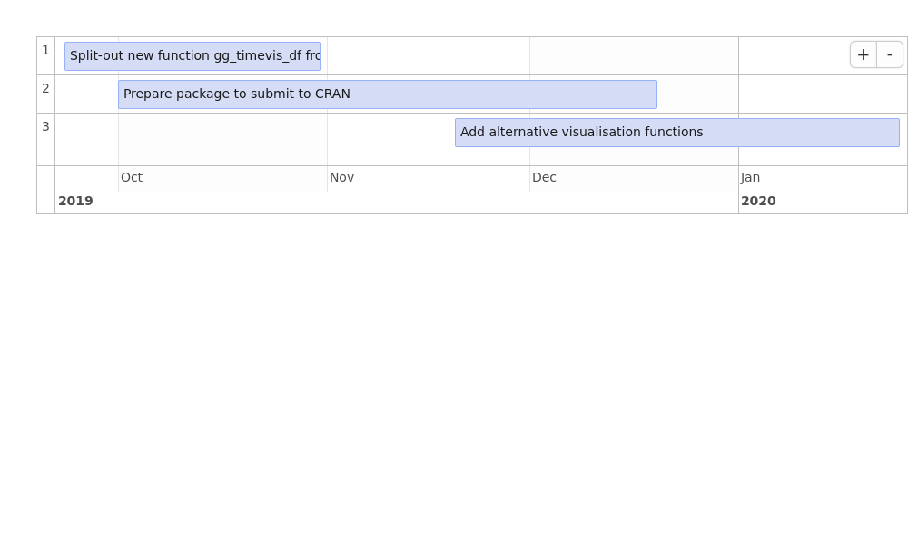

<!-- README.md is generated from README.Rmd. Please edit that file -->

# gitgantt

<!-- badges: start -->

<!-- badges: end -->

The goal of gitgantt is to make it easier to create project plans via
GitHub.

Problem: you need to show your plan in a report or funding application,
but all the planned work is stashed in GitHub issues.

Solution: add lines containing `GanttStart:` and `GanttDue:` to your
issues and use **gitgantt** to convert them into an attractive Gantt
chart in a single line of code\!

``` r
library(gitgantt)
gg_timevis(owner = "robinlovelace", repo = "gitgantt")
#> 3 issues returned for the repo gitgantt
```



## Installation

<!-- You can install the released version of gitgantt from [CRAN](https://CRAN.R-project.org) with: -->

<!-- ``` r -->

<!-- install.packages("gitgantt") -->

<!-- ``` -->

Install the development version from [GitHub](https://github.com/) with:

``` r
remotes::install_github("robinlovelace/gitgantt")
```

## How it works

The packages uses [`gh`]() to extract issue data from GitHub and code
inspired by
[jennybc/analyze-github-stuff-with-r](https://github.com/jennybc/analyze-github-stuff-with-r)
to clean the data into a `tibble`:

``` r
issue_list = gg_issue_list(owner = "ATFutures", repo = "who3")
#> 5 issues returned for the repo who3
issue_df = gg_issue_df(issue_list)
issue_df
#> # A tibble: 5 x 7
#>   number title         body          start_date due_date   state created_at
#>    <int> <chr>         <chr>         <date>     <date>     <chr> <date>    
#> 1      5 Adaptation M… "GanttStart:… 2019-10-01 2019-11-01 open  2019-05-29
#> 2      4 User Manual   "GanttStart:… 2019-09-01 2019-10-01 open  2019-05-29
#> 3      3 HEAT Integra… "Including t… 2019-08-01 2019-09-01 open  2019-05-29
#> 4      2 scenario dev… "GanttStart:… 2019-07-01 2019-08-01 open  2019-05-29
#> 5      1 Demo transla… ""            NA         NA         open  2018-12-07
```

## Thanks

This project is inspired by and builds on:

  - Excellent demonstration of using `gh` in the
    [analyze-github-stuff-with-r](https://github.com/jennybc/analyze-github-stuff-with-r)
    by Jenny Bryan
  - The [GanttLab](https://www.ganttlab.org/) project, which initially
    inspired this effort and defined the `GanttStart:` convention
  - The [`gh-issues-gantt`](https://github.com/neyric/gh-issues-gantt)
    JavaScript package, which in turn builds on
    [jQuery.Gantt](http://taitems.github.com/jQuery.Gantt/) (raising the
    possibility for using this for the visualisation)
  - The [`gh`](https://github.com/r-lib/gh) R package, an interface
    GitHub’s API
